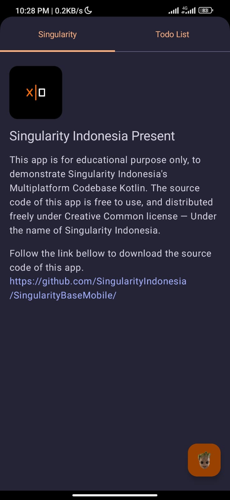
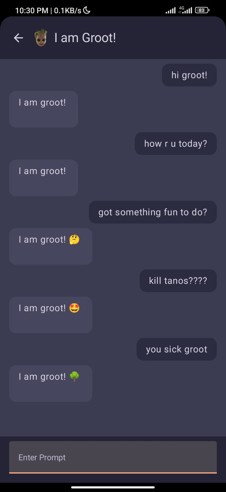

# Singularity Codebase is Now a Multi Platform!!


**Code once, run everywhere with Compose Multiplatform!**<br/>
*Always under the development process.*

I created this codebase to help startup companies kickstart their projects with Kotlin Multiplatform.
This code is free to use and distribute under the Creative Commons License.

This guide will help you to shape the thinking framework and understanding the codebase: [README_GUIDE.md](Docs/Guide)

# Previously; Set me free? Sure why not.
The CC license is created to protect the creator and the team, under the name of singularity indonesia.
You are not allowed to remove the copyright notice wherever it is. However, you can do so with a "free software" license. You can get the license by sending a request via email to: stefanus.ayudha@gmail. com.  The free software license is free of charge. We do this to keep track of who is using our software to help further in the future, as well as to help us to improve our software. After you have a "free software" license, you can do whatever you want and are no longer bound to us.

## What is so cool
### I am Groot!
This codebase comes with Groot AI assistant module as example of Gemini AI integration. This codebase featured with gemini module to make it ready to launch AI powered Application.
<p>
  
  
</p>

### Plugins
- **Postman WebClient Generator Plugin**. This codebase is equipped with the web Postman WebClient Generator gradle plugin. Once you enable this plugin in module gradle, all you need to do is put postman collection to the module. This plugin will automatically convert the postmant collection into web clients and generate all the response, request, header - models automatically. See [Postman WebClient Generator Plugin plugin](Docs/Postman%20Client%20Generator.md).
### Features
- **GEMINI AI!**. This codebase featured with gemini ai sdk ready to use with examples!.
- Integrated Release Note. see: [build with integrated release note](Main/composeApp/build.gradle.kts) and [Release Note](Main/composeApp/ReleaseNote.md).
- Module Generator Script. This codebase is equiped with `create.sh` to generate module easily. See [Tips](#create-a-module).
- Using **Gradle Composite Build**. This project is a Gradle **multi-project**. We separate the layers into several projects to allow for further development scaling. You can open whole project or each project individually.
- Is **multi-module**. This will make build process faster.
### Design
- **Centralized Context control**. Read: [Centralized Context Control.md](Docs%2FCentralized%20Context%20Control.md)
- Modules are **designed to be scaled horizontally**. No matter how many modules you add, the build performance will be fine during the development process. This is possible because the architecture of this codebase is designed to scale horizontally to optimize the **Gradle Caching**.
- Using the **Gradle Convention Plugin**. Although you may not need it much during the development process as it is automated, for more advanced developers, you can create your own conventions.
- Design system ready in **material3**.
- **Ready for large scale project**. This codebase is designed to serve as the foundation **for large-scale projects**. You don't need to worry about how to scale up your codebase, because it's designed for that.

## Promises
More module will be added in the future such camera, biometic, etc.

## Request a Feature
I would love to know what you need. If you need a module, feel free to request for it. You can find me in discord as `stefanus ayudha#7707` or [Mail me at stefanus.ayudha@gmail.com](mailto:stefanus.ayudha@gmail.com).

## Contributing
Read [README_CONTRIBUTING.md](Docs/Contributing)

## Temporary
It's unfortunate that the Kotlin context receiver feature is currently only available on the JVM.
However, the Kotlin team is actively working on it. Once the context receiver is ready, the design of this codebase will be finalized.

## Tips
### Make directory look better
Create new workspace scope to make it look better in Intelij/Android studio, you can use this pattern:
```
!file[*]:gradle//*&&!file[*]:iosApp//*&&!file[*]:.fleet//*&&!file[*]:gradle.properties&&!file[*]:gradlew&&!file[*]:.gitignore&&!file[*]:gradlew.bat&&!file[*]:.idea//*&&!file[*]:settings.gradle.kts&&!file[*]:.kotlin//*
```


### Create a Module
You can use create.sh to create a module easily.
```bash
# create example module in Main project.
$./create.sh -n "example"
# or
$./create.sh -t "main" -n "example"

# create example module in Shared project.
$./create.sh -t "shared" -n "example"

# create example module in System project.
$./create.sh -t "system" -n "example"
```

## Meet the author
[Stefanus Ayudha](https://www.linkedin.com/in/stefanus-ayudha-447a98b5/).
I would be happy to help you in creating an extraordinary starting.


